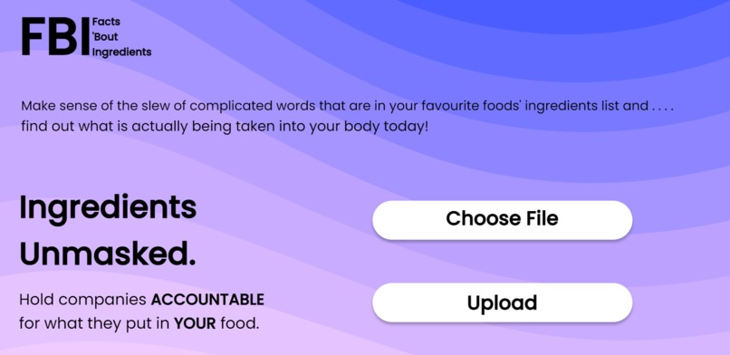

# 🕵️‍♀️ FBI - Facts 'Bout Ingredients

#### [RU Hacks 2022](https://ru-hacks-2022-digital-15171.devpost.com/) first place winner 🥇

Web app to convert photos of food ingredient labels into researched descriptions of individual ingredients, rendered in an intuitive and readable format

### How we built it 🔨
- Our front-end and user-interface was designed and built using React
- API endpoints and all request handling was done with Python/Flask
- [PaddleOCR](https://github.com/PaddlePaddle/PaddleOCR) was utilized to perform accurate optical character recognition 

### Images/Demo 📷
[](https://www.youtube.com/watch?v=igmloHsiuGA)
[](https://www.youtube.com/watch?v=igmloHsiuGA)

### Try it out 🏗
Set up repository
```
git clone https://github.com/addison-ch/FBI/
cd /FBI
```

Set up back-end server

   ```
   cd /api
pip install -r requirements.txt
flask run
   ```

Set up front-end client (seperate console window)
```
cd /client
npm install
npm start
```
